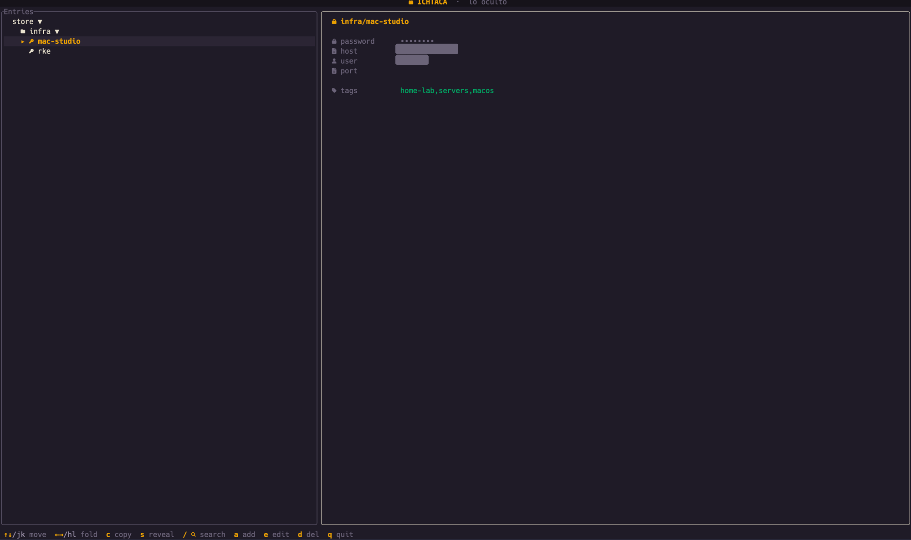
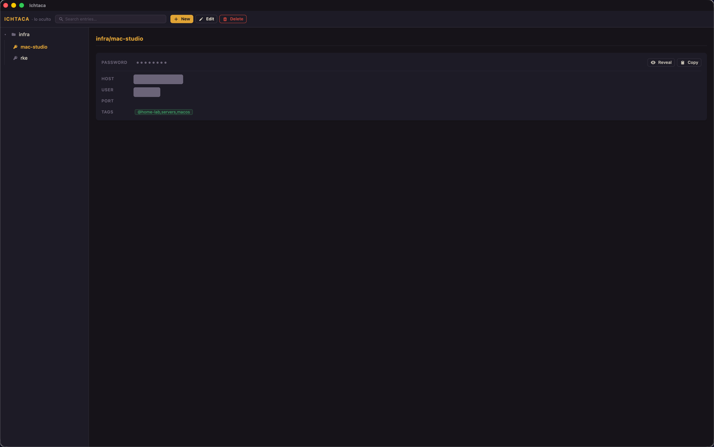

# Ichtaca

> **lo oculto** — a `pass` client for the terminal and desktop

**Ichtaca** (Classical Nahuatl: *"the hidden / the secret"*; pronounced *ich-TA-ka*) is a front-end for [`pass`](https://www.passwordstore.org/), the standard Unix password manager. It does **not** replace `pass` — it wraps the `pass` CLI and `gpg`/`gpg-agent`, giving you a richer interface over your existing `~/.password-store`.

---

## Screenshots

**`ichtaca` — terminal UI**



**`ichtaca-desktop` — desktop GUI**



---

## What is this?

Ichtaca provides two apps that share a single Rust core library (`passcore`):

| App | Binary | Description |
|-----|--------|-------------|
| **Ichtaca TUI** | `ichtaca` | Full-featured terminal UI (keyboard-driven) |
| **Ichtaca Desktop** | `ichtaca-desktop` | Native desktop GUI (Tauri + Svelte) |

Both apps read and write the same `~/.password-store` directory that `pass` manages — no data migration needed.

### Requirements

- [`pass`](https://www.passwordstore.org/) installed and on `$PATH`
- `gpg` / `gpg-agent` installed and a key configured
- An initialized password store (`pass init <gpg-key-id>`)
- **TUI only:** a [Nerd Font](https://www.nerdfonts.com/) configured in your terminal emulator (for folder/key/lock icons)
- Rust (stable) — see [Building](#building)

Supported platforms: **macOS** and **Linux**.

---

## Features

- **Tree browser** — navigate your store directory tree with keyboard or mouse
- **Entry detail panel** — view fields parsed from the `pass` format (password, username, URL, notes, custom fields)
- **Password masked by default** — reveal on explicit action (`s` / Reveal button)
- **Copy to clipboard** — copies the password via `pass`; clipboard is auto-cleared after 45 seconds (configurable) and only if the clipboard still holds the copied value
- **TOTP / OTP codes** — generate and copy one-time passwords from `otpauth://` URIs stored in entries
- **Create / edit / delete entries** — form-based with user-defined templates; or raw `$EDITOR` edit
- **Password generator** — CSPRNG-backed; configurable length and character set
- **Fuzzy search** — live search across all entry paths, plus an on-demand content search (`Ctrl-f`) that decrypts entries to match inside bodies and tags
- **`git` passthrough** — if your store is a git repo, `pass` manages commits as usual

---

## Building

### TUI (`ichtaca`)

```sh
# Run from source
cargo run -p pass-tui

# Install to ~/.cargo/bin/
cargo install --path crates/pass-tui
```

The produced binary is named `ichtaca`.

### Desktop GUI (`ichtaca-desktop`)

The Rust crate embeds the compiled frontend. **Build the UI before the Rust crate.**

```sh
# 1. Build the Svelte/Vite frontend
npm --prefix crates/pass-tauri/ui run build

# 2. Build and run the native binary
cargo run -p pass-tauri

# — or — produce installers (requires tauri-cli)
cargo install tauri-cli --version "^2"
cargo tauri build
```

Tauri only bundles for the **host OS**: `app`/`dmg` on macOS, `deb`/`appimage` on Linux.

#### Opening the macOS app (alpha is unsigned)

The alpha `.dmg`/`.app` is **not code-signed or notarized** yet, so macOS Gatekeeper
will block it on first launch ("unidentified developer" / "damaged"). To open it:

- **Right-click** (or Control-click) the app → **Open** → **Open** (only needed once), **or**
- remove the quarantine flag from a terminal:
  ```sh
  xattr -dr com.apple.quarantine /Applications/Ichtaca.app
  ```

A properly signed + notarized build (no warning) requires an Apple Developer ID;
the release workflow signs automatically once the Apple secrets are configured.

#### Releases & artifacts

Pushing a tag like `v26.6.0-alpha` triggers `.github/workflows/release.yml`, which
builds the desktop bundles (macOS `.dmg`, Linux `.deb`/`.AppImage`) and the TUI
binary tarballs for macOS (arm64 + Intel) and Linux, and attaches them to a draft
GitHub Release.

#### Node version note

The frontend build requires Node (v22 recommended). If `node`/`npm` are shell functions wrapping another version manager, ensure the real binaries are on `PATH` before running `npm`.

#### Development mode

Build the frontend first (the Rust crate embeds `ui/dist` at compile time), then run:

```sh
npm --prefix crates/pass-tauri/ui run build
cargo run -p pass-tauri
```

> The Tauri `beforeBuildCommand` is intentionally empty so the frontend build is
> explicit and deterministic in CI — always build the UI before building/bundling
> the Rust crate.

---

## Usage & Key Bindings

| Key | Action |
|-----|--------|
| `↑` / `k` | Move up in tree |
| `↓` / `j` | Move down in tree |
| `←` / `h` | Collapse directory |
| `→` / `l` | Expand directory |
| `Enter` | Select entry |
| `/` | Open fuzzy search |
| `Ctrl-f` | In search: content search — decrypts entries to match body/tags (slower) |
| `c` | Copy password to clipboard |
| `s` | Toggle password reveal |
| `a` | Add new entry |
| `e` | Edit selected entry (form) |
| `E` | Raw edit in `$EDITOR` |
| `d` | Delete selected entry |
| `q` / `Esc` | Quit |

---

## Security Model

Ichtaca is designed to keep secrets off disk and out of logs.

- Decryption is done by `gpg`/`gpg-agent` via the `pass` CLI — the app never writes decrypted data to disk
- In-memory secrets are zeroized on drop ([`zeroize`](https://crates.io/crates/zeroize)); `Secret` values are redacted in `Debug` output
- Passwords are **masked by default** and only revealed on an explicit user action
- Clipboard copies are auto-cleared after 45 seconds (configurable), using an ownership check so a value the user has since replaced is not wiped
- **Desktop app:** plaintext stays in the Rust backend. IPC commands that handle secrets (`copy_password`, `otp_code`) do the work in the backend and return nothing sensitive to the webview. Only the explicit `reveal_password` / `reveal_otp_uri` commands cross the IPC boundary with plaintext, and only on user request. A strict Content Security Policy (no remote scripts, no remote URLs) is enforced
- No telemetry, no network connections (other than `git` if your store uses it)

See [SECURITY.md](SECURITY.md) for the full security policy and vulnerability reporting instructions.

---

## Configuration

Configuration file: `~/.config/pass-client/config.toml` (XDG: `$XDG_CONFIG_HOME/pass-client/config.toml`).

The file is optional — all settings have sensible defaults. Example:

```toml
[clipboard]
clear_after = 45   # seconds

[keybindings]
copy   = "c"
reveal = "s"
search = "/"
quit   = "q"

[ui]
reveal_default = false

[generator]
length  = 20      # number of characters in a generated password
symbols = true    # include punctuation (!@#$…); set false for alphanumeric-only
```

### Password generator

The built-in generator is a CSPRNG (OS-backed, rejection-sampled so there is no
modulo bias) shared by both frontends. Both the length and the character set are
configurable via the `[generator]` section above (read from
`~/.config/pass-client/config.toml`):

- `length` — password length in characters (default `20`).
- `symbols` — when `true` (default) the charset is alphanumeric plus
  `!@#$%^&*()-_=+`; when `false` it is alphanumeric only.

---

## Project Layout

```
crates/
  passcore/      — core library: store access, parsing, TOTP, clipboard, search, templates
  pass-tui/      — TUI frontend (tui-realm / ratatui)
  pass-tauri/    — desktop frontend (Tauri 2 + Svelte + Tailwind / DaisyUI)
```

---

## Status

**Alpha** — `26.6.0-alpha` (CalVer YY.MM.PATCH). The core features work, but expect rough edges, missing documentation, and breaking changes before a stable release. Use on a real password store at your own risk; always keep a backup.

---

## Contributing

See [CONTRIBUTING.md](CONTRIBUTING.md).

---

## License

MIT — see [LICENSE](LICENSE).
