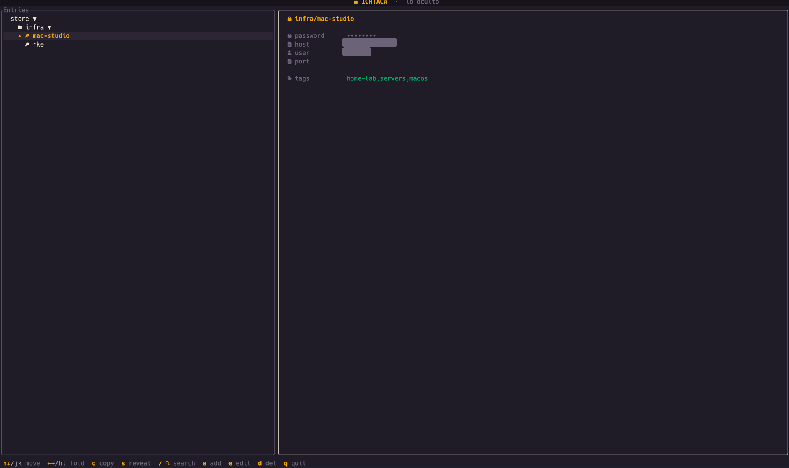
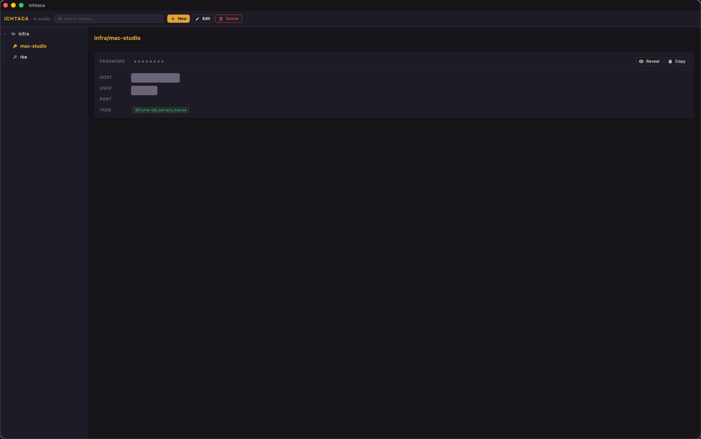

<p align="center">
  
</p>

<h1 align="center">Ichtaca</h1>

<p align="center"><strong>Your passwords. Local. Yours.</strong></p>

<p align="center">
  A free, open-source password manager for your <strong>terminal</strong>, <strong>desktop</strong>, and <strong>scripts</strong> —<br>
  a richer interface over the trusted <a href="https://www.passwordstore.org/"><code>pass</code></a> + <code>gpg</code>. No cloud. No telemetry. No account.
</p>

<p align="center">
  <a href="https://github.com/chrnx-dev/ichtaca/blob/main/LICENSE"></a>
  <a href="https://github.com/chrnx-dev/ichtaca/releases/latest"></a>
  <a href="https://github.com/chrnx-dev/ichtaca/actions/workflows/ci.yml"></a>
  
  
</p>

<p align="center">
  <a href="#installation"><strong>Install</strong></a> ·
  <a href="#cli-reference">CLI</a> ·
  <a href="#security-model">Security</a> ·
  <a href="https://chrnx-dev.github.io/ichtaca/">Website</a>
</p>

<p align="center"><sub><em>Ichtaca</em> — Classical Nahuatl for <em>"the hidden / the secret"</em>, pronounced <em>ich-TA-ka</em>.</sub></p>

---

## Screenshots

**`ichtaca` — terminal UI**



**`ichtaca-desktop` — desktop GUI**



---

## Why Ichtaca

- **Local-first — no cloud, ever.** Your secrets live in your own `~/.password-store`, encrypted with your GPG key. Nothing is uploaded, synced to a vendor, or locked behind an account.
- **You own the keys.** Encryption and decryption are delegated entirely to `gpg`/`gpg-agent`. Ichtaca invents no new format and never writes plaintext to disk.
- **No telemetry, no network.** No analytics, no phone-home — only `git`, and only if *your* store uses it.
- **Zero migration.** It wraps the standard Unix [`pass`](https://www.passwordstore.org/): point it at your existing store and it just works. Keep using `pass` side by side.
- **Open source (MIT).** Audit every line.

> Ichtaca does **not** replace `pass` — it gives you a far richer interface over the same `~/.password-store`.

---

## Three ways, one store

Two apps and a CLI share a single Rust core (`passcore`) and the same `~/.password-store` — no migration, no new format:

| | Binary | Best for |
|---|--------|----------|
| **Terminal TUI** | `ichtaca` | Keyboard-driven browse, search & edit without leaving the shell |
| **Desktop GUI** | `ichtaca-desktop` | A native window (Tauri + Svelte) for point-and-click |
| **Scriptable CLI** | `ichtaca <subcommand>` | Automation & pipelines — `get`, `set`, `otp`, `generate`, `doctor`… |

> **Try it with no store and no setup:** `ICHTACA_DEMO=1 ichtaca` launches a labeled demo with fake data. See [Trying it without a store](#trying-it-without-a-store).

### Requirements

- [`pass`](https://www.passwordstore.org/) installed and on `$PATH`
- `gpg` / `gpg-agent` installed and a key configured
- An initialized password store (`pass init <gpg-key-id>`)
- **TUI only:** a [Nerd Font](https://www.nerdfonts.com/) configured in your terminal emulator (for folder/key/lock icons)
- Rust (stable) — see [Building](#building)

Supported platforms: **macOS** and **Linux**.

---

## Features

- **Tree browser** — navigate your store with vim keys (`hjkl`) or arrows; fields parsed straight from the `pass` format (password, user, URL, notes, custom fields)
- **Masked by default** — passwords reveal only on an explicit action; never on screen by accident
- **Live TOTP** — paste the secret key a site shows you (or a full `otpauth://` URI) and Ichtaca builds, validates, and computes the code
- **Copy & auto-clear** — clipboard clears after 45s (configurable), and only if the value is still the one you copied
- **Create / edit / delete** — form-based with templates, custom fields & tags — or drop to a raw `$EDITOR`
- **CSPRNG generator** — cryptographically secure passwords, configurable length and charset
- **Fuzzy + content search** — instant path search, plus on-demand body/tag search (`Ctrl-f`) that decrypts to match
- **Scriptable CLI** — pipe-safe output, stable `--json`, stable exit codes for automation
- **`git` passthrough** — if your store is a git repo, `pass` manages commits as usual

---

## Installation

### macOS

```sh
# Homebrew prerequisites (if not already installed)
brew install pass gnupg
```

Download the latest release from [GitHub Releases](https://github.com/chrnx-dev/ichtaca/releases/latest):
- `ichtaca-macos-arm64.tar.gz` (Apple Silicon) or `ichtaca-macos-x86_64.tar.gz` (Intel) — TUI binary
- `Ichtaca.dmg` — desktop app

Or build from source (see [Building](#building) below).

### Linux

Install prerequisites via your distro's package manager, for example on Debian/Ubuntu:

```sh
sudo apt install pass gnupg2
```

Download the Linux release artifacts:
- `ichtaca-linux-x86_64.tar.gz` — TUI binary
- `ichtaca-desktop.deb` / `ichtaca-desktop.AppImage` — desktop app

Or build from source.

---

## First-time setup

If you do not have a password store yet, create one from scratch:

```sh
# 1. Generate a GPG key (choose RSA 4096 or Ed25519; remember the passphrase)
gpg --full-generate-key

# 2. Find your new key's ID
gpg --list-secret-keys --keyid-format=long

# 3. Initialise the store
pass init <your-gpg-key-id>

# 4. Verify everything is ready
ichtaca doctor
```

`ichtaca doctor` exits 0 and prints `ok` for every check when the environment is ready. It exits 2 and prints guidance when something is missing.

### Using an existing store

If your store lives somewhere other than `~/.password-store`, point Ichtaca at it with the standard `pass` environment variable:

```sh
export PASSWORD_STORE_DIR=/path/to/your/store
```

Ichtaca respects `PASSWORD_STORE_DIR` exactly as `pass` does.

---

## Trying it without a store

Set `ICHTACA_DEMO=1` to launch an explicit demo session seeded with obviously-fake entries — no `pass` or `gpg` required:

```sh
ICHTACA_DEMO=1 ichtaca          # TUI demo
ICHTACA_DEMO=1 ichtaca-desktop  # Desktop demo
```

The TUI shows a `· DEMO` marker in the header; the desktop shows a `DEMO` badge in the navbar. Demo mode is **not your real data** and is not connected to any password store.

---

## CLI reference

Running `ichtaca` with no arguments launches the interactive TUI. Running `ichtaca <subcommand>` runs non-interactively and exits.

### Commands

| Command | Description |
|---------|-------------|
| `ichtaca doctor` | Check pass / gpg / store; exits 0 when ready, 2 when not |
| `ichtaca list` | Print all entry paths, one per line |
| `ichtaca search <query>` | Fuzzy-search entry paths |
| `ichtaca get <path>` | Print the password to stdout (no trailing newline; pipe-safe) |
| `ichtaca show <path> [--json]` | Print metadata only: path, fields, tags, `has_otp`. **Does not print the password or OTP URI.** |
| `ichtaca otp <path>` | Print the current TOTP code |
| `ichtaca copy <path>` | Copy the password to the clipboard, then clear it after the configured `clear_after` timeout (blocks until cleared; Ctrl-C to keep). If `clear_after` is 0, copies and returns immediately without clearing. |
| `ichtaca generate <path> [--length N] [--no-symbols]` | Generate and store a password, then print it to stdout; **refuses if the entry already exists** |
| `ichtaca set <path> [--password-stdin] [--field key=value ...] [--tag tag ...] [--remove-field key ...] [--remove-tag tag ...] [--otp secret-or-uri] [--remove-otp]` | Create or update an entry; preserves anything you do not mention |
| `ichtaca git [status\|pull\|push]` | Git sync for the store repo. `status` is local-only; `pull`/`push` behave exactly like plain `git`, prompts included |

#### One-time codes (TOTP)

You never have to write an `otpauth://` URI by hand. In the OTP field of either app — or with `ichtaca set --otp` — paste **either**:

- the **secret key** the site shows you next to the QR code (`JBSW Y3DP EHPK 3PXP`); spaces, dashes, padding and lowercase are all fine, or
- a **full `otpauth://totp/…` URI**, if you exported one from another manager.

A bare secret is wrapped into a URI labelled with the entry's own name and its `user` field, so the account still identifies itself if you ever import it elsewhere. A pasted URI is kept exactly as you typed it — unusual parameters and all — after being checked.

Invalid input is refused at save time with the reason, in all three frontends. Previously a bad secret was stored happily and only failed later when you asked for a code.

```bash
# from the secret key on the site's 2FA page
ichtaca set web/github.com --otp "JBSW Y3DP EHPK 3PXP"

# or from a URI exported by another manager
ichtaca set web/github.com --otp "otpauth://totp/GitHub:alice?secret=JBSWY3DPEHPK3PXP&issuer=GitHub"

ichtaca otp web/github.com     # 123456
ichtaca set web/github.com --remove-otp
```

Defaults follow RFC 6238: SHA-1, 6 digits, 30-second period. Non-default values come through a pasted URI (`algorithm=`, `digits=`, `period=`) — which is how any service that uses them will hand them to you.

**The secret is the second factor.** It lives in the entry as a plain `otpauth://` line, encrypted with the rest of the entry by GPG. Anyone who can decrypt the entry has both factors, so storing a password and its TOTP secret together trades some of 2FA's benefit for convenience — a deliberate choice `pass` users generally make knowingly. The raw URI is only revealed on an explicit action, never in listings or `--json` output. Keep the site's recovery codes somewhere else.

#### Git sync

`pass` already commits every write for you when `~/.password-store` is a git repo — Ichtaca adds the part `pass` leaves out: seeing that you have unpushed commits, and pushing them.

The TUI footer shows a chip with the branch and how far ahead of the remote you are (` main ↑2`), and `Ctrl-g` pulls then pushes. The desktop app shows the same chip in its footer; click it to sync. **If the store is not a git repo, none of this appears** — no chip, no key, no nagging.

The behind count (`↓`) comes from local refs, so it is only as fresh as your last pull. Nothing here ever fetches on its own.

To put an existing store under git:

```bash
pass git init
pass git remote add origin <url>
pass git push -u origin main
```

Merge conflicts are deliberately not handled in-app: a failed pull stops before the push and leaves the store for you to fix with `pass git`.

#### `ichtaca show` JSON shape

```json
{"path":"web/example.com","fields":[["user","alice"]],"tags":["work"],"has_otp":true}
```

The password and raw OTP URI are intentionally excluded.

#### `ichtaca set` — secrets via stdin, never argv

Passwords are always read from stdin using `--password-stdin`. This keeps secrets out of shell history and process listings. Repeat `--field`/`--tag`/`--remove-field`/`--remove-tag` for multiple values. All flags are optional but at least one must be provided.

#### `ichtaca generate` defaults

Default length is `32` characters. Override with `--length N`. Use `--no-symbols` for alphanumeric-only.

### Exit codes

| Code | Meaning |
|------|---------|
| `0` | Success |
| `1` | User / input error (bad argument, entry not found, no OTP configured, etc.) |
| `2` | Missing dependency or store (pass not installed, gpg not installed, store not initialised) |
| `3` | Store / decrypt failure (GPG error, I/O error, git error) |

### Examples

```sh
# Store a password (read from stdin)
printf 'hunter2\n' | ichtaca set web/example.com --password-stdin --field user=me

# Add fields to an existing entry without changing the password
ichtaca set web/example.com --field url=https://example.com

# Add tags and a field in one shot
ichtaca set web/gh --field user=me --tag work --tag dev

# Remove a stale field and a tag
ichtaca set web/gh --remove-field old --remove-tag dev

# Show metadata as JSON and pretty-print it
ichtaca show web/example.com --json | jq .

# Get the password and copy it yourself (macOS)
ichtaca get web/example.com | pbcopy

# Generate a 24-character alphanumeric password
ichtaca generate dev/api-key --length 24 --no-symbols

# Check the TOTP code for an entry
ichtaca otp email/work

# Copy to clipboard (auto-clears after the configured timeout)
ichtaca copy email/work
```

---

## Building

### TUI (`ichtaca`)

```sh
# Run from source
cargo run -p pass-tui

# Install to ~/.cargo/bin/
cargo install --path crates/pass-tui
```

The produced binary is named `ichtaca`.

### Desktop GUI (`ichtaca-desktop`)

The Rust crate embeds the compiled frontend. **Build the UI before the Rust crate.**

```sh
# 1. Build the Svelte/Vite frontend
npm --prefix crates/pass-tauri/ui run build

# 2. Build and run the native binary
cargo run -p pass-tauri

# — or — produce installers (requires tauri-cli)
cargo install tauri-cli --version "^2"
cargo tauri build
```

Tauri only bundles for the **host OS**: `app`/`dmg` on macOS, `deb`/`appimage` on Linux.

#### Opening the macOS app (unsigned)

The macOS `.dmg`/`.app` is **not code-signed or notarized** yet, so macOS Gatekeeper
will block it on first launch ("unidentified developer" / "damaged"). To open it:

- **Right-click** (or Control-click) the app → **Open** → **Open** (only needed once), **or**
- remove the quarantine flag from a terminal:
  ```sh
  xattr -dr com.apple.quarantine /Applications/Ichtaca.app
  ```

A properly signed + notarized build (no warning) requires an Apple Developer ID;
the release workflow signs automatically once the Apple secrets are configured.

#### Releases & artifacts

Pushing a tag like `v26.9.0-beta.1` triggers `.github/workflows/release.yml`, which
builds the desktop bundles (macOS `.dmg`, Linux `.deb`/`.AppImage`) and the TUI
binary tarballs for macOS (arm64 + Intel) and Linux, and attaches them to a draft
GitHub Release.

#### Node version note

The frontend build requires Node (v22 recommended). If `node`/`npm` are shell functions wrapping another version manager, ensure the real binaries are on `PATH` before running `npm`.

#### Development mode

Build the frontend first (the Rust crate embeds `ui/dist` at compile time), then run:

```sh
npm --prefix crates/pass-tauri/ui run build
cargo run -p pass-tauri
```

> The Tauri `beforeBuildCommand` is intentionally empty so the frontend build is
> explicit and deterministic in CI — always build the UI before building/bundling
> the Rust crate.

---

## Usage & Key Bindings

| Key | Action |
|-----|--------|
| `↑` / `k` | Move up in tree |
| `↓` / `j` | Move down in tree |
| `←` / `h` | Collapse directory |
| `→` / `l` | Expand directory |
| `Enter` | Select entry |
| `/` | Open fuzzy search |
| `Ctrl-f` | In search: content search — decrypts entries to match body/tags (slower) |
| `c` | Copy password to clipboard |
| `s` | Toggle password reveal |
| `a` | Add new entry |
| `e` | Edit selected entry (form) |
| `E` | Raw edit in `$EDITOR` |
| `d` | Delete selected entry |
| `Ctrl-g` | Git sync: pull `--rebase` then push (only when the store is a git repo) |
| `q` / `Esc` | Quit |

---

## Security Model

Ichtaca is designed to keep secrets off disk and out of logs.

- Decryption is done by `gpg`/`gpg-agent` via the `pass` CLI — the app never writes decrypted data to disk
- In-memory secrets are zeroized on drop ([`zeroize`](https://crates.io/crates/zeroize)); `Secret` values are redacted in `Debug` output
- Passwords are **masked by default** and only revealed on an explicit user action
- Clipboard copies are auto-cleared after 45 seconds (configurable), using an ownership check so a value the user has since replaced is not wiped
- **Desktop app:** plaintext stays in the Rust backend. IPC commands that handle secrets (`copy_password`, `otp_code`) do the work in the backend and return nothing sensitive to the webview. Only the explicit `reveal_password` / `reveal_otp_uri` commands cross the IPC boundary with plaintext, and only on user request. A strict Content Security Policy (no remote scripts, no remote URLs) is enforced
- No telemetry, no network connections (other than `git` if your store uses it)

See [SECURITY.md](SECURITY.md) for the full security policy and vulnerability reporting instructions.

---

## Configuration

Configuration file: `~/.config/pass-client/config.toml` (XDG: `$XDG_CONFIG_HOME/pass-client/config.toml`).

The file is optional — all settings have sensible defaults. Example:

```toml
[clipboard]
clear_after = 45   # seconds

[keybindings]
copy   = "c"
reveal = "s"
search = "/"
quit   = "q"

[ui]
reveal_default = false

[generator]
length  = 20      # number of characters in a generated password
symbols = true    # include punctuation (!@#$…); set false for alphanumeric-only
```

### Password generator

The built-in generator is a CSPRNG (OS-backed, rejection-sampled so there is no
modulo bias) shared by both frontends. Both the length and the character set are
configurable via the `[generator]` section above (read from
`~/.config/pass-client/config.toml`):

- `length` — password length in characters (default `20`).
- `symbols` — when `true` (default) the charset is alphanumeric plus
  `!@#$%^&*()-_=+`; when `false` it is alphanumeric only.

---

## Project Layout

```
crates/
  passcore/      — core library: store access, parsing, TOTP, clipboard, search, templates
  pass-tui/      — TUI frontend (tui-realm / ratatui)
  pass-tauri/    — desktop frontend (Tauri 2 + Svelte + Tailwind / DaisyUI)
```

---

## Troubleshooting

### GPG agent / pinentry issues

- **"No pinentry program" / GPG prompt does not appear** — install a pinentry program: `brew install pinentry-mac` (macOS) or `sudo apt install pinentry-curses` (Linux), then configure it in `~/.gnupg/gpg-agent.conf`:
  ```
  pinentry-program /usr/local/bin/pinentry-mac
  ```
  Restart the agent: `gpgconf --kill gpg-agent`.

- **"Inappropriate ioctl for device"** — this happens when GPG cannot access the terminal (e.g. inside a script or piped command). Export the current TTY before running:
  ```sh
  export GPG_TTY=$(tty)
  ```
  Add this to your shell profile (`~/.zshrc`, `~/.bashrc`) to make it permanent.

- **Agent not running** — start it with `gpg-agent --daemon` or let GPG start it automatically on the next operation.

### Missing clipboard backend

- **macOS** — `pbcopy` is built in; no action needed.
- **Linux (Wayland)** — install `wl-clipboard`: `sudo apt install wl-clipboard` (or distro equivalent). Ichtaca uses `wl-copy` / `wl-paste`.
- **Linux (X11)** — install `xclip`: `sudo apt install xclip`. Ichtaca falls back to `xclip` when `wl-copy` is not found.

If neither tool is available, `ichtaca copy` exits with an error asking you to install one.

### macOS Gatekeeper ("unidentified developer" / "damaged app")

The desktop release is **not yet code-signed or notarized**. macOS Gatekeeper will block it on first launch. To open it:

- **Right-click** (or Control-click) the app → **Open** → **Open** (needed only once), **or**
- remove the quarantine flag:
  ```sh
  xattr -dr com.apple.quarantine /Applications/Ichtaca.app
  ```

Signing and notarization are planned for a future release. The TUI binary (`ichtaca`) is not affected — it runs from the terminal without Gatekeeper restrictions.

### Using a non-default store location

Set `PASSWORD_STORE_DIR` to point to your store:

```sh
export PASSWORD_STORE_DIR=/path/to/store
ichtaca doctor   # confirm it is found
```

---

## Status

**Beta** — `26.9.0-beta.1` (CalVer YY.MM.PATCH). The core read/write features are stable across the TUI, desktop, and CLI, and git sync and TOTP entry are complete. Known rough edge: the macOS build is unsigned. Expect possible breaking changes before a stable release. Use on a real password store at your own risk; always keep a backup.

---

## Contributing

See [CONTRIBUTING.md](CONTRIBUTING.md).

---

## License

MIT — see [LICENSE](LICENSE).
